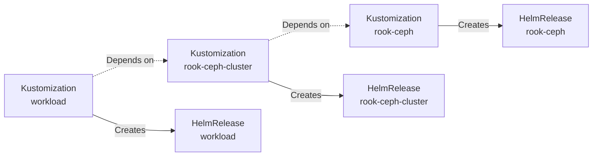

## Overview

A one-liner, so what? A home cluster running media, monitoring, and home-automation workloads on a 3-node cluster, ~50 HelmReleases and GitOps.

Little bit more detailed, this is a mono repository for a single Kubernetes cluster. Used as a learning project that provides a hands-on approach for Kubernetes cluster configurations and test best practices. Adherence to Infrastructure as Code (IaC), GitOps and CI/CD practices keeps me from having to tend to the cluster manually.

Through this journey I've ended up with the following tool stack:

- **OS and Kubernetes**: [Talos Linux](https://www.siderolabs.com/talos-linux) and [Kubernetes](https://kubernetes.io).
- **GitOps and CD**: [Flux](https://fluxcd.io)
- **Package Management and Overlays**: [Helm](https://www.helm.sh) and [Kustomize](https://kustomize.io).
- **Dependency Management and CI**: [Renovate](https://www.mend.io/renovate/) and [GitLab CI](https://docs.gitlab.com/ci/).
- **Toolchain**: [mise](https://mise.jdx.dev), [hk](https://hk.jdx.dev) and [flate](https://github.com/home-operations/flate)

This isn't a turnkey "production cluster" or "enterprise-at-home" template — it's my actual home cluster and pretty boring (intentionally), with all the inconsistencies that come from evolving a real system. Read it for ideas, not prescription.

Recognizing constraints is an important step in sustainable design and as such different principles have been applied at different times. I generally, however, keep to the same philosophical approaches.

1. **Declarative ordering over procedural workarounds.** Multi-step upgrades should be handled by Flux and rely on dependsOn and health-checks, avoid "merge, wait and merge again" approaches.
2. **Filenames describe what's inside, directories describe where it belongs.** Manifests are named after their resource `kind:` in kebab-case. Namespace and HelmRelease names are reflected in the directory path, not duplicated in filenames.
3. **One source of truth.** Avoid duplication of configuration and logic, use tools like Kustomize and Helm to templatize and reuse common patterns. local (pre-commit), CI (GitLab CI) and runtime (Flux) run the same checks against the same configs. DRY when patterns repeat; accept duplication when they don't.
5. **Cattle, not pets.** Kubernetes presumes disposability and immutability of workloads, that mindset extends to the cluster and to the hardware it runs on.

## Cluster

### Core components

- **OS:** Talos Linux on bare metal / VMs, declared via templated machine configs in `talos/`.
- **Networking:** Cilium for CNI, Envoy Gateway for north-south ingress.
- **Storage:** Rook-Ceph for block, OpenEBS for local volumes, VolSync for backup orchestration.
- **Databases:** CloudNativePG for Postgres workloads.
- **Secrets:** External Secrets Operator pulling from an external store.
- **Certificates:** cert-manager with external-dns wiring DNS challenges.
- **Observability:** kube-prometheus-stack + Grafana + Fluent-bit + VictoriaLogs.
- **Image lifecycle:** Renovate (versions) and tuppr (in-cluster upgrades).

### Directory structure

```sh
kubernetes/
├── apps/<namespace>/<app>/         # one HelmRelease's worth of manifests per directory
│   ├── flux-kustomization.yaml     # Flux Kustomization CR(s) — the unit Flux reconciles
│   └── resources/                  # the workload itself: HelmRelease, ConfigMap, Secret, ...
├── components/                     # shared kustomize components included by multiple apps
└── flux/config/                    # the bootstrap-source Flux reconciles from
talos/
├── machineconfig.yaml.j2           # templated node config
├── nodes/                          # per-node overrides
└── schematics/                     # Talos image schematics
```

`kubernetes/apps/<namespace>/kustomization.yaml` is the per-namespace release manifest — comment out an app to disable it without deleting files.

### GitOps workflow

1. Renovate opens MRs for tool/image/chart updates on its schedule.
2. GitLab CI runs lint (hk-aware) and `flate diff` (offline render of branch vs. main) on every MR. The diff is posted as an upsertable MR comment, refreshed on every push.
3. Reviewer (me) merges. Flux reconciles `kubernetes/flux/config/` on its interval, walks the Kustomization graph, applies changes in `dependsOn` order with health-gating.
4. Drift is recovered automatically — Flux owns the cluster, the cluster doesn't own itself.

#### Flux Reconcilion Graph



### Networking

- **CNI:** Cilium with kube-proxy replacement, eBPF dataplane.
- **Ingress:** Envoy Gateway for HTTP(S), with cert-manager issuing certificates via external-dns DNS-01 challenges.
- **DNS:** external-dns publishes records to Cloudflare (public) and UniFi (internal).
- **Tunnels:** cloudflared exposes selected internal services without opening firewall ports.
- **Cluster DNS:** CoreDNS.

```mermaid
flowchart LR

subgraph NETWORK [Network VLANs] 
    LOCAL[Clients<br/>192.168.10.0/24]
    SERVERS[Cluster<br/>192.168.45.0/24]
    SERVICES[Services<br/>192.168.46.0/24]
    IOT[IoT<br/>192.168.30.0/24]
    GUEST[Guest<br/>192.168.50.0/24]
end

ISP[ISP<br/>1Gbps]
UDM[UDM Pro]
SW[USW Enterprise 24 PoE]
FLEX[USW Flex 2.5G]
NAS[Kubernetes<br/>1 Node+NAS]
K8s[Kubernetes<br/>3 Nodes]
DEV[Devices]
WIFI[WiFi Clients]

style TOPOLOGY fill:transparent,stroke:#fff,stroke-width:0px,rx:0,ry:0,padding:20px;
subgraph TOPOLOGY [Topology]
    direction LR
    ISP -.->|WAN| UDM
    UDM -- 10G --- SW
    SW -- 2.5G --- FLEX
    FLEX -- 2.5G --- K8s
    FLEX -- 2.5G --- NAS
    SW -- 1G --- DEV
    SW -- 1G --- WIFI
end
```
